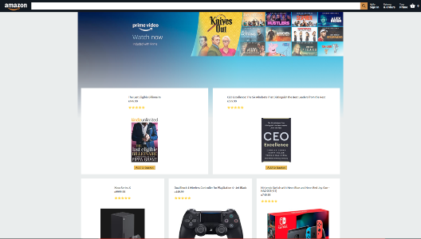

  

# What an awesome project this was!

This project consists of the Amazon homepage, which includes a bunch of products which can be added to cart, or removed. The cart adds the total amount of items as well the cost of all items thanks to the react currency format.

This clone also has a working authentication system with a sign in and sign out feature. The sign in (email & password) was super simple thanks to the Firebase configs.

## TLDR for tech stack: React.js, React Router, React Context API and React Currency Format with Firebase.

# How to test sign in features:

On the sign in page:

Enter a random email (e.g: 12312@1313.com). Enter a random password. Click on "Create your Amazon Account".
And you're good to go! 
Please note that this project is not mobile friendly yet. I'll look into making it responsive whenever I can. For now, I'd recommend viewing this project from an actual desktop browser.

You can view the project live at  [Amazon Clone Website](https://clone-94bcd.web.app/).

