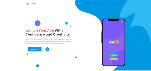

  

# Responsive App Landing Page

A super simple mock-up landing page for an app launch. I added a few animations for that extra razzle dazzle!

## TLDR for tech stack: HTML, CSS and Javascript

## Click the play button to see something cool! :D

Link to live project - [Landing Page](httpsd://dev-app-landing-page.netlify.app/).

