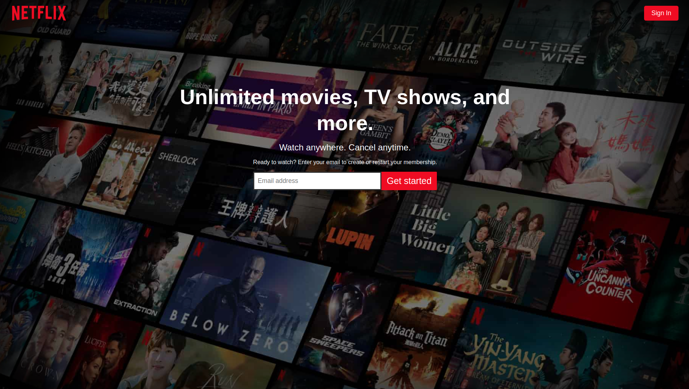

  

# Netflix Landing Page Clone

After learning a lot about HTML and CSS, I thought it would be a great idea to try and taake those skills, and apply them to recreating Netflix's landing page. It actually turned out quite well, even if I do say so myself! ;D

## Tech stack: HTML and CSS.

Link to live project - [Netflix Landing Page](https://netflixlander.netlify.app/).

