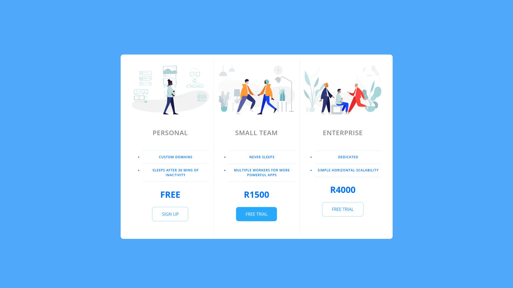

  

# Responsive Pricing Panel

I decided to complete a few projects from Colt Steele's Bootcamp, with the Pricing Panel being one of many to come! ;) While my job hunt continues, I need to make sure my web-dev skills are in top form!

## Tech stack: HTML and CSS.

Link to live project - [Pricing Panel](https://pricing-panel1.netlify.app/).

